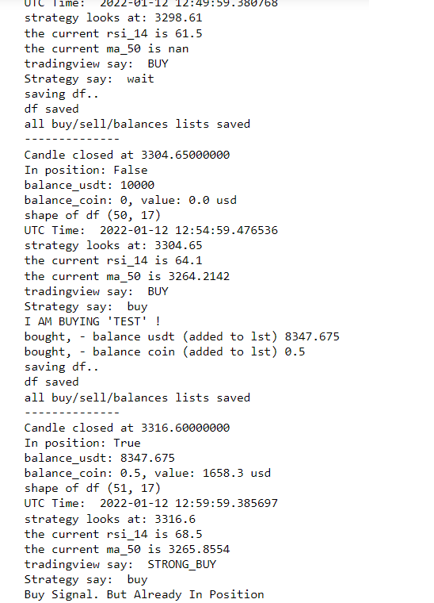
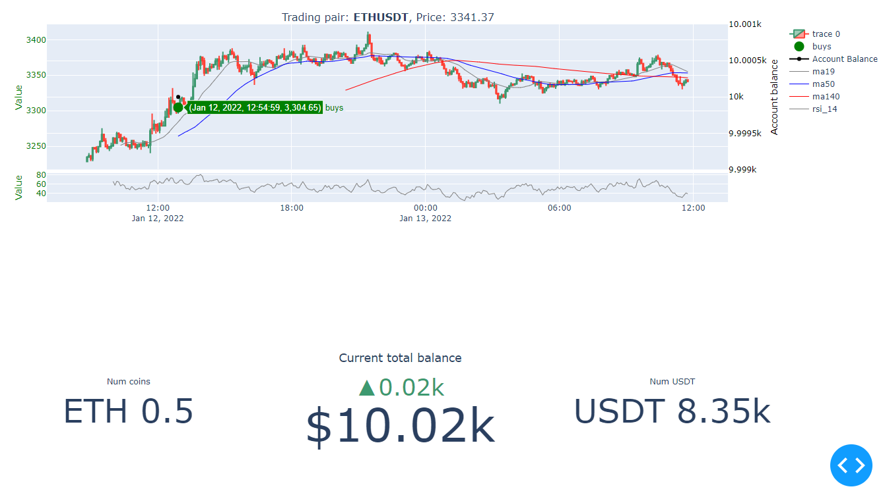
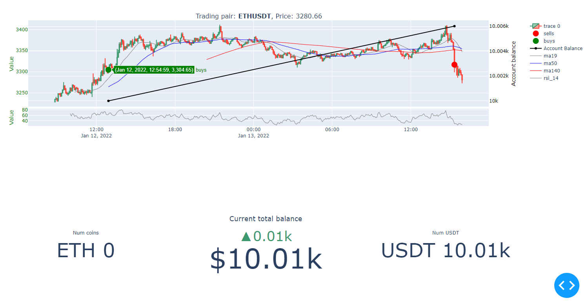

#  Crypto trade bot

## 1. What it is

Trading bot connected to Binance API.
#### This project made for fun. So ...  Do not use to trade live before you have backtested and modified/ created your own strategy function you are happy with.

## 2. How to

1. Update settings and strategy function in bot.py. By default it will not place live orders. ('place_live_orders = False')
2. Add your API key /secret in config.py
3. Run trade bot, bot.py
4. Run dashboard, dashboard.py. To view dashboard, open your browser and type localhost:8050

Prototyped in jupyter notebook where yoy can play with settings and strategy.

CLI:

## 3. What the Dashboard looks like

- Graph where you can see trades taken
- Follow how your cash/coin balance changes over time. Track trades based on startegy even though no live orders are placed
- Account balance from Binance

-----------------------------------------
-----------------------------------------
-----------------------------------------

